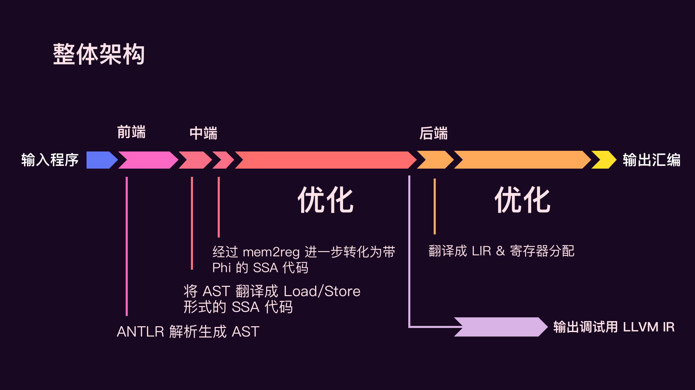
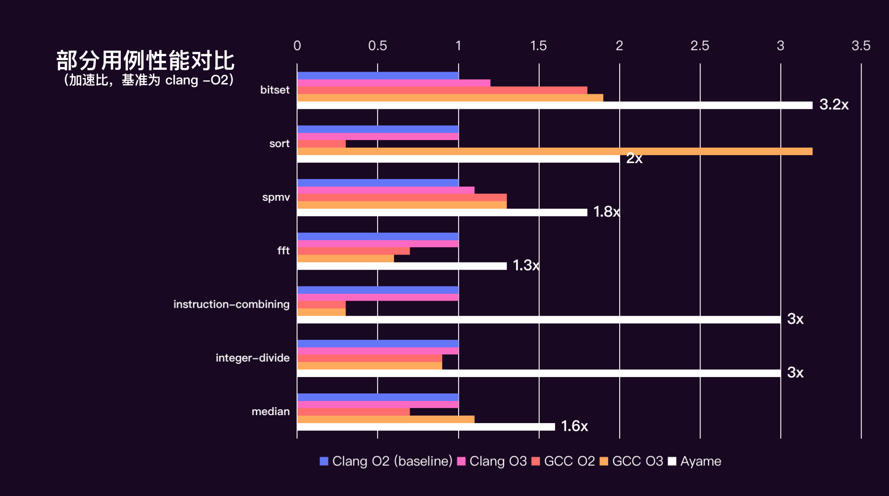

北京航空航天大学 No Segmentation Fault Work 队作品。

# ayame

A toy compiler that translates SysY (a subset of C language) into ARMv7a.


# Build

```shell
javac -encoding UTF-8 $(find . -name "*.java") -cp lib/antlr4-runtime-4.8.jar:lib/argparse4j-0.9.0.jar
```

# Usage

```shell
java -classpath src:lib/antlr4-runtime-4.8.jar:lib/argparse4j-0.9.0.jar Compiler -S {sy_file} -o {asm_file} [-O2]
```

# Architecture



# Passes

- 中层
  +  全局值编号 (GVN)
  +  全局代码移动 (GCM)
  +  过程内死代码删除
  +  过程间死代码删除
  +  函数内联
  +  LCSSA
  +  删除无用循环
  +  循环展开
  +  局部数组提升&标记常量数组
  +  全局变量局部化
  +  分支优化
  +  静态分支预测瞎蒙
  +  归纳变量强度削弱
  +  循环合并
- 底层
  + Codegen (消除 Phi 指令/除法优化)
  + 图着色寄存器分配
  + 窥孔优化
  + 指令调度
  + 合并基本块（条件执行）

# Performance



# Special Thank
Special thank to  [@lynzrand](https://github.com/lynzrand) for designing the icon for Ayame.